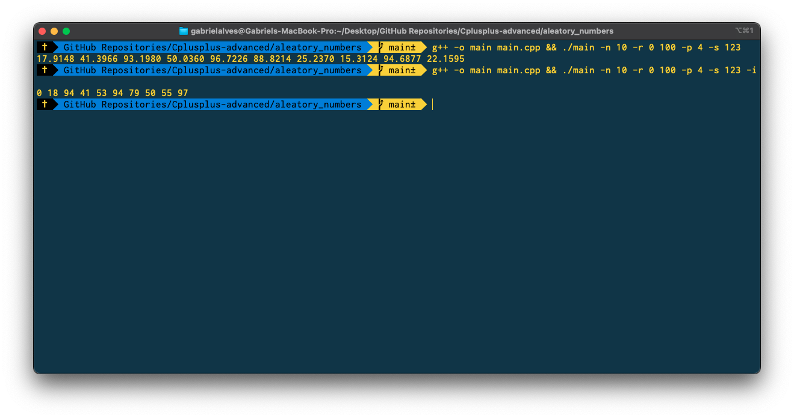

# Gerar Números Aleátorios

Este script em C++ gera números aleatórios a partir de argumentos passado na execução `./main`

## Argumentos 
* `-i`  Se informado, gera números inteiros.
* `-n N` Se informado, gera *N* númeors aleátorios. **Default: N=1**.
* `-r a b` Se informado, irá gerar número aleátorio no intervalo [a,b]. **Default: [0,1]**.
* `-p x` Se informado, os números devem ser apresentados com *x* casas decimais. **Default: x=4**.
* `-s S` Se informado, *S* é a semente utilizada para gerar os números aleatórios. Se não informado é usado o *timestamp*.

## Compilação

`g++ -o main main.cpp` Para compilar.
`./main args` Para executar - Passar argumentos e seus respectivos parâmetros se necessário.

### Exemplo

